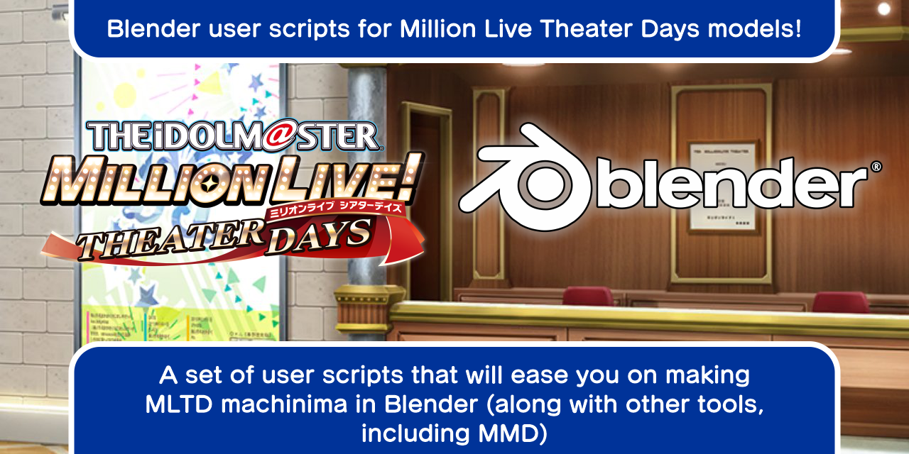

# Blender user script for MLTD models
===
 
 
 So, you want to make that MLTD machinima you're dreaming of, but found that MLTD models
 is tougher to deal with than you expect? Fear not, because if you use Blender, you can
 use the scripts in this repository to (hopefully) ease you on managing that MLTD models!

## What Blender version should I use?

    The scripts are written and tested with Blender 2.91, so Blender 2.8 or above should work
    well. I can't guarantee for Blender 2.79 or below, though.

## Installation

    As of now, the scripts are came in the form of user scripts, not add-on, therefore you don't
    have to install the script through Blender's add-on manager.
    To use the script(s) in your project, simply copy one of the Python code included in the
    [Scripts](Scripts/) folder to your Blender's Scripts tab, and run the script.

## What if I got errors from the script?

    First, make sure that you copied the code correctly. Failing to do so will render the script
    useless.
    However, if you have copied it correctly, but still getting error, file an *issue* to me.
    You can also fix the error yourself, and file a pull request from your fork.
